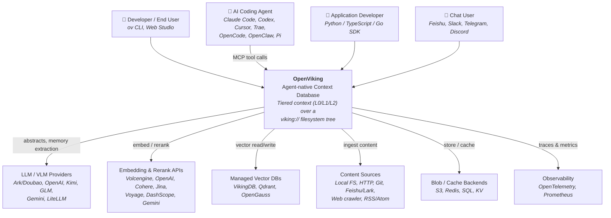
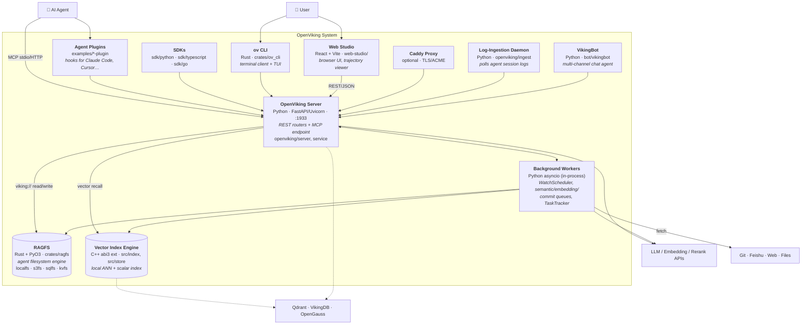
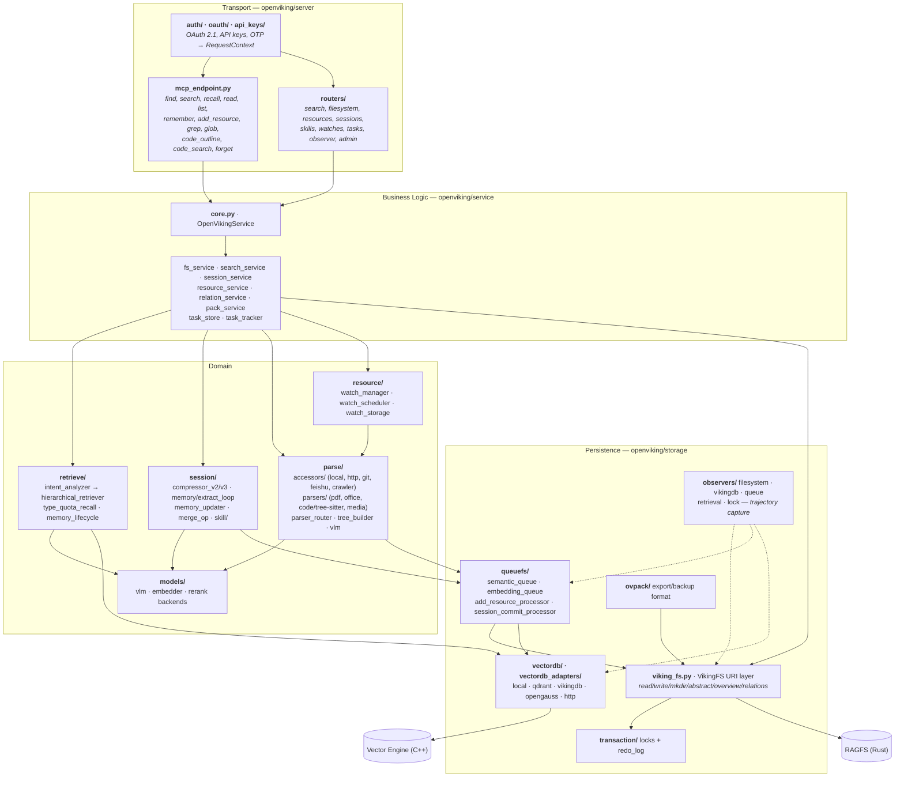
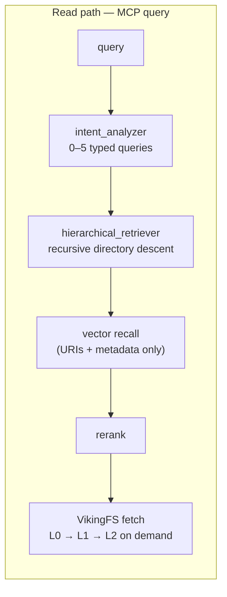
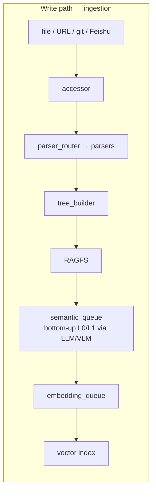
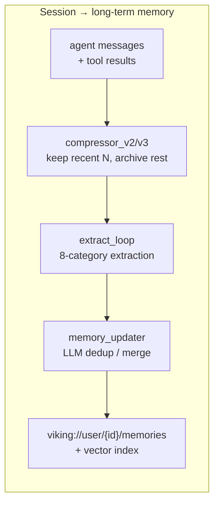
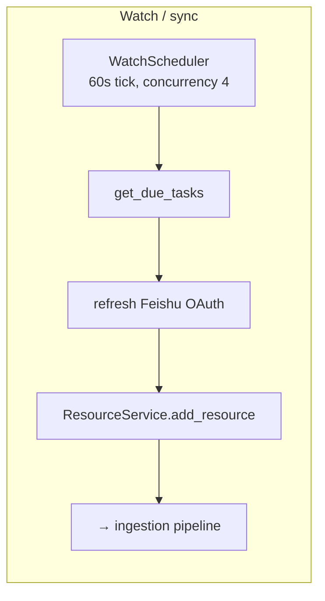
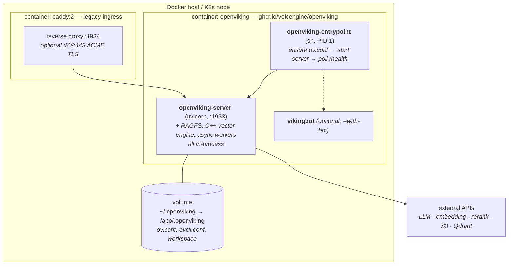

# OpenViking — C4 Architecture

## Level 1 — System Context

## Level 2 — Containers

## Level 3 — Components (OpenViking Server)

## Key Flows

## Runtime & Infrastructure

### Deployment topology

**The whole system is one application container.** RAGFS, the C++ vector index engine, and every background worker (WatchScheduler, semantic/embedding/commit queues, TaskTracker) run in-process inside `openviking-server` — they are logical containers in the C4 sense, not separate images. Compose declares no database, cache, or vector-DB service; external stores are reached over the network only when configured.

### Build pipeline

Three-stage [Dockerfile](../Dockerfile), because one wheel bundles four toolchains:

| Stage | Base | Produces |
|---|---|---|
| 1 · `rust-toolchain` | `rust:1.91.1-trixie` | Rust toolchain (ragfs-python's S3 feature set needs ≥ 1.91.1) |
| 2 · `py-builder` | `ghcr.io/astral-sh/uv:python3.13-trixie-slim` | `/app/.venv` — cargo + Node 24 + cmake copied in, `uv sync --no-editable --extra bot --extra gemini` |
| 3 · runtime | `python:3.13-slim-trixie` | Final image: venv + entrypoint only |

`setuptools` is the build backend; `setup.py` drives all three native builds — `build_py` compiles the web-studio SPA (npm/Vite), `build_ext` compiles the C++ vector engine (cmake), and `build_ov_cli_artifact` cargo-builds the `ov` CLI. BuildKit cache mounts cover uv, npm, cargo registry/git/target, and ccache (gcc/g++ routed through `/usr/lib/ccache`).

Runtime OS packages are deliberately thin: `ca-certificates`, `curl`, `git`, `libstdc++6`, `ripgrep` (ripgrep backs the `grep`/`glob` MCP tools; `git` backs the git accessor).

`requires-python = ">=3.10"`, but the shipped image runs 3.13.

### Startup sequence

[docker/openviking-entrypoint.sh](../docker/openviking-entrypoint.sh) is PID 1 and does three things beyond `exec`:

1. **Config gate** — if `/app/.openviking/ov.conf` is missing, it writes one from `OPENVIKING_CONF_CONTENT` if set; otherwise it starts `pending_health_server.py` on :1933 that answers every request with a 503 explaining the fix, then polls every 5s until the file appears. So a misconfigured container is diagnosable over HTTP rather than crash-looping.
2. **Launch** — `openviking-server --host 0.0.0.0 [--with-bot]`. `OPENVIKING_WITH_BOT` defaults to **1** in the image, so Docker runs VikingBot in the same container by default; the Helm chart sets `bot.enabled: false`.
3. **Health barrier & signals** — polls `/health` up to 120×1s, exits non-zero if the server dies or times out, and forwards `INT`/`TERM` to the server PID.

Any other argv (`openviking --help`, `openviking-server init`) is `exec`'d directly, so the image doubles as the CLI.

Health is `GET /health` at every layer — Docker `HEALTHCHECK`, compose healthcheck, and K8s liveness/readiness probes.

### Configuration & secrets

Single volume at `/app/.openviking` mirroring the host `~/.openviking` holds `ov.conf`, `ovcli.conf`, and workspace data. `OPENVIKING_CONFIG_FILE` / `OPENVIKING_CLI_CONFIG_FILE` point at them; `HOME=/app`.

In Helm, `config:` is rendered into a ConfigMap mounted as `ov.conf` — covering `storage.workspace`, `vectordb.backend`, embedding/VLM provider blocks (Volcengine Ark defaults), and `server.*`. Secrets (`root_api_key`, provider API keys) are meant to come through `extraEnv` + `secretKeyRef` rather than the ConfigMap; `root_api_key` is required whenever `host` is `0.0.0.0`.

### Kubernetes

[deploy/helm/openviking](../deploy/helm/openviking): `replicaCount: 1`, `Service` ClusterIP:1933, optional Ingress (cert-manager annotations sketched in comments), requests 500m/1Gi and limits 2 CPU/4Gi, PVC `ReadWriteOnce` 20Gi at `/app/.openviking`.

**Scaling caveat:** `replicaCount: 1` + an RWO PVC + `server.workers: 1` + in-process queues and lock manager mean this is a single-instance deployment. Horizontal scaling isn't something the chart supports as written — the workers and `storage/transaction/` locks assume one process owns the workspace.

## Persistence Summary

| Data | Store |
|---|---|
| L0 abstract / L1 overview / L2 content | RAGFS — `.abstract.md`, `.overview.md`, content files |
| Relations graph | RAGFS — `.relations.json` per directory |
| Vectors + URIs + scalar metadata | Local C++ engine (LevelDB) or Qdrant / VikingDB / OpenGauss / HTTP |
| Memories | `viking://user/{user_id}/memories` |
| Skills | `viking://user/{user_id}/skills` (`SKILL.md`) |
| Resources | `viking://resources/...` |
| Sessions, messages, tool results | RAGFS + vector index |
| Watch tasks (incl. OAuth state) | RAGFS JSON via `watch_storage.py` |
| API keys / OAuth clients / OTP | `server/api_keys/`, `server/oauth/storage.py` |
| Locks / redo log | `storage/transaction/` |
| Export / backup | `.ovpack` archives |
| Caches | Redis / Mooncake / YuanRong; s3fs & sqlfs local caches |
| Config | `ov.conf` (`~/.openviking`) |
